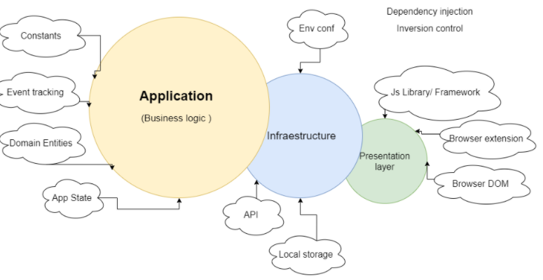

Welcome! this is a small but humilde project.
made with love  💓

# Technologies used
    - The app was created using "Create-react-app" 
    - Lang Typescript
    - React router dom, for the navigation
    - Scss
    - React Query, Fetch, cache and update data from the HTTP requests
    - im using SVG for the graph

# Application folder structure

    Application: All related with the domain context.
    Infraestructure: All the things that have to communicate with other systems
    Presentation layer: Everything that has to do with user interaction or visualization 

# Why did I take these technologies?

    I think the speed and size that ReactJs offers to build an application is remarkable. Apart of this, ReactJs offers state management through hooks that makes it easy to control state without the need for third-party libraries.

    Typescript is used as a language to validate when working and transpiling that they are complying with the previously defined structure in each of the interactions.

    React Query, is the coolest thing in the world, to manage cache and the status of the queries and commands of our application without the need to use complex steps and that also gives us the status of each HTTP request and side effects

# How did I check the performance of the app?

    - Checking memory and CPU load
    - Lighthouse 

